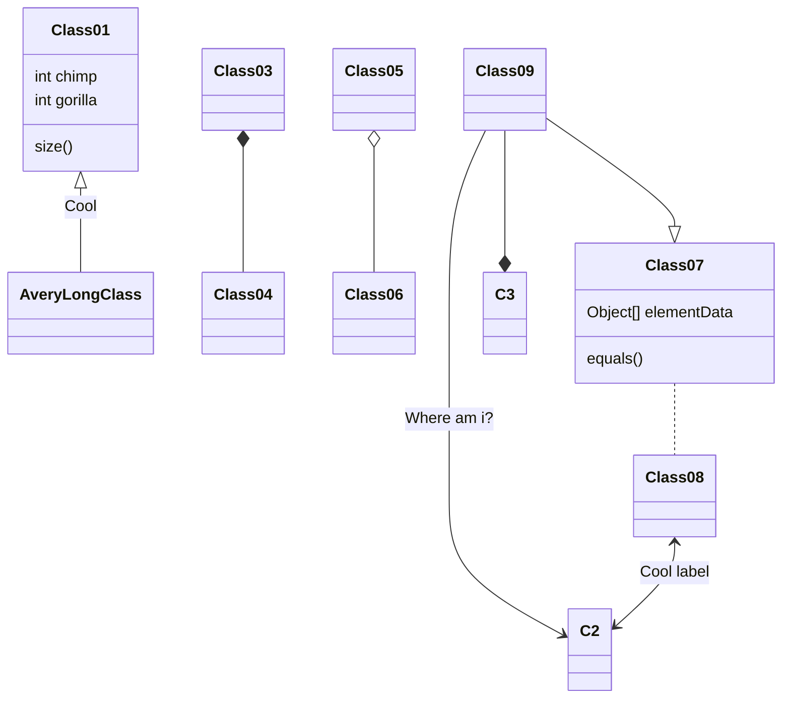

### Javascript
- Javascript is `single` threaded(one command executing at a time)
- What if we want to `delay some code` but `not blocking the thread` from any further coding running `while we wait`.


### Execution Analysis
- Global Memory (declaration)
- Callstack
- Global Context
- Lexical Scope
- Local Context

### Web Browser APIs
- Definition
  - Web Browser has a Javascript `Runtime`
  - It also has a lot of `builtin` tools/features
  - These ``tools/features`` are called web browser APIs.
- Example
  - `setTimeout()`
  - `alert()`
  - `navigator.geolocation`
  - `XMLHttpRequest`
- Explanation
  - They run `outside` of the JavaScript runtime. Those "Web API's" are executed within the browser's `Web API execution space`. 
  - `setTimeout()` for example, is a method of the window object (it can also be invoked as window.setTimeout()). window is not at all part of JavaScript (it's a browser object) and anything you ask the window to do for you is handled outside of the JavaScript runtime and by the browser's other capabilities. `The request for the Web API call originates from within the JavaScript environment, but the execution of the API call actually runs outside of it.`
  - This is the very reason that we can have `asynchronous` behavior in web applications. While the JavaScript runtime (which is a synchronous environment that can only do one thing at a time) is doing its one thing, the browser can be doing something else.

### Code
- `"Me First"` will appear first
- since setTimeout is a `web brower api` function
- which is running `outside` javascript runtime
```javascript
function printHello(){
  console.log("Hello");
}

setTimeout(printHello, 2);
console.log("Me First");
```
- But what if we set timeout to 0
```javascript
function printHello(){
  console.log("Hello");
}

setTimeout(printHello, 0);
console.log("Me First");
```
- Guess:
  - Javascript runtime `first`
  - `Then` web api execution space
```javascript
function printHello(){
  console.log("Hello");
}

function printWorld(){
  console.log("World");
}

setTimeout(printHello,1.5);
console.log("Me First");


setTimeout(printWorld, 1);
console.log("2printout");
```

